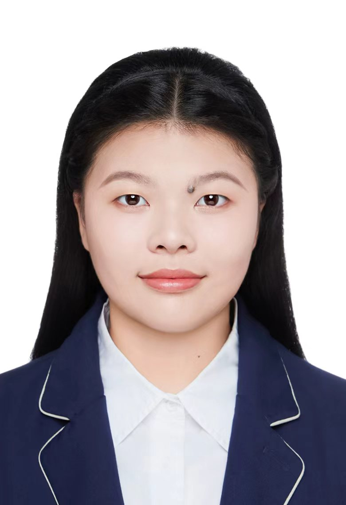

# 吴君竹

**上海杉达学院 · 计算机科学与技术 · 大二在读 · 19 岁** 
**联系电话：** 18930416859 
**电子邮箱：** [1668608622@qq.com](mailto:1668608622@qq.com) / [wujunzhu86@gmail.com](mailto:wujunzhu86@gmail.com) 
**技术与实践方向：** 鸿蒙应用开发、程序设计、大语言模型评估 
**GitHub：** [github.com/wujunzhu0802](https://github.com/wujunzhu0802)

## 个人简介

上海杉达学院计算机科学与技术专业大二学生，19 岁。具有独立开发并上架鸿蒙 App 的实践经历，参与 UTAR 同行 App（与拉曼大学合作）和 HRAgent 员工关系系统开发，完成家庭公约助手 App 开发及多项鸿蒙、OpenHarmony 相关实习实训。曾获杉达杯产教融合创新大赛一等奖、全国大学生嵌入式芯片与系统设计竞赛应用赛道二等奖，并在程序设计、计算机应用和数学建模竞赛中取得成绩。围绕大语言模型亚健康评估与检测机制参与论文研究，相关论文已投稿至 SEC，持续积累应用开发、竞赛与科研实践经验。

## 教育背景

**上海杉达学院** 
计算机科学与技术专业 · 大二在读

## 开发与项目经历

### 鸿蒙 App 独立开发与上架

**角色：独立开发者**

- 独立完成鸿蒙 App 开发，并将应用上架。
- 具有从应用开发到上架交付的完整实践经历。

### UTAR 同行 App

**项目背景：与拉曼大学合作的应用开发项目** 
**角色：参与开发**

- 参与与拉曼大学合作的 UTAR 同行 App 开发，积累合作项目中的应用开发实践经验。

### HRAgent 员工关系系统

**项目方向：员工关系业务场景的系统开发** 
**角色：参与开发**

- 参与 HRAgent 员工关系系统开发，积累面向员工关系业务场景的系统开发实践经验。

### 家庭公约助手 App

**项目背景：软通动力鸿蒙应用开发实习实训**

- 在鸿蒙应用开发实习实训中完成家庭公约助手 App 开发。
- 获得对应的 App 开发实习实训证书。

### 基于 OpenHarmony 的具身智能仿真开发项目

**项目背景：实习实训**

- 参加基于 OpenHarmony 的具身智能仿真开发项目实习实训。
- 完成实训并获得结业证书，拓展鸿蒙相关技术在具身智能仿真场景中的实践经验。

## 科研经历

### SAIL: Indicator-based Sub-health Assessment and Detection Mechanism for Large Language Models

**投稿去向：SEC · 状态：已投稿**

- 研究主题为大语言模型的亚健康状态评估与检测机制。
- 论文围绕基于指标的大语言模型状态评估与检测展开，已完成投稿。

## 竞赛荣誉

- **全国大学生嵌入式芯片与系统设计竞赛 · 应用赛道二等奖**
- **杉达杯产教融合创新大赛 · 一等奖**
- **上海市计算机应用能力大赛 · 市赛优胜奖**
- **上海杉达学院程序设计秋季赛 · 三等奖 × 2**（2025—2026）
- **2026 MCM/ICM 美国大学生数学建模竞赛 · S 奖**

## 认证与实习实训

- HarmonyOS 应用开发者基础认证。
- 软通动力与上海交通大学创新项目实习实训证书。
- 软通动力鸿蒙应用开发实习实训证书。
- 软通动力鸿蒙应用开发——家庭公约助手 App 开发实习实训证书。
- 基于 OpenHarmony 具身智能仿真开发项目实习实训结业证书。

## 技术与实践积累

- **鸿蒙生态**：鸿蒙 App 开发与上架、HarmonyOS SDK 开放能力、OpenHarmony 项目实训。
- **合作开发**：参与 UTAR 同行 App 与 HRAgent 员工关系系统开发，积累不同应用场景中的开发实践经验。
- **程序设计与计算机应用**：具有校程序设计竞赛及上海市计算机应用能力大赛参赛获奖经历。
- **建模与科研训练**：具有 MCM/ICM 数学建模竞赛经历，以及大语言模型评估与检测方向的论文投稿经历。

## 个人优势

- **独立交付经历**：完成鸿蒙 App 的独立开发与上架，将开发实践落实为可发布的应用。
- **多场景实践**：经历应用开发、嵌入式系统相关竞赛、数学建模与具身智能仿真项目实训。
- **持续学习积累**：通过开发者认证、项目实训、学科竞赛与论文研究，持续拓展技术与工程实践经验。

## 自我介绍

你好，我是吴君竹。我喜欢把学到的知识用到实际项目中，也愿意在独立开发和团队协作中不断尝试。从鸿蒙应用到合作开发项目，我希望一步步拓宽自己的技术视野，把每一次实践中的收获变成下一次开发的进步。

## 写给未来的自己

**保持好奇，继续开发。**

不必等到准备万全才开始。把想法做出来，在问题中学习，在反馈中改进。坚持完成一个个小作品，认真对待每一次迭代；今天多写的一行代码、多解决的一个问题，都会成为继续前行的底气。
